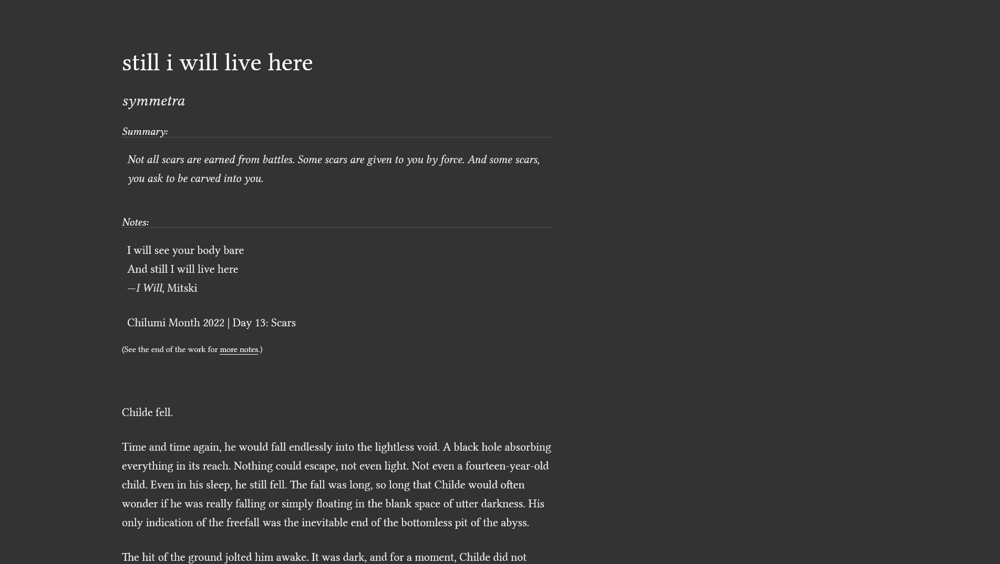

# Tufte AO3
Stylus stylesheet for Archive of our own, inspired by and based on [Tufte CSS](https://edwardtufte.github.io/tufte-css/)

This stylesheet only modifies the workskin and nothing else.

## Preview

## Install

1. Install [Stylus](https://add0n.com/stylus.html) browser extension/addon
2. Install stylesheet from [UserStyles page](https://userstyles.world/style/10166/tufte-ao3)
3. Alternatively, download `style.css` from this repo and upload into Stylus

## Notes
Download Linux Libertine font here: https://sourceforge.net/projects/linuxlibertine/

There's a selection of serif fonts available in the code, just edit the variable `--font-family`. You may add your own through Google fonts or other CDN!

This style conflicts with userscript: **AO3: Fic's Style, Blacklist, Bookmarks**
- Simply disable the _Styling_ feature and this should work

This does **not** take into account other fic formats, ie, chatfics, etc. It also assumes that it is formatted properly, ie, there's no wacky double spacing.

## Feedback

Found a bug? Any design or accessibility issues? I am open to any and all suggestions! Open an [issue](https://github.com/tencurse/tufte-ao3/issues) or [contribute](https://github.com/tencurse/tufte-ao3/pulls) to the source code.
